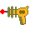

# PySnake
The classic arcade game Snake reimagined in Python using [Pygame](https://www.pygame.org/news) 🐍

## Run Game
**Note**: requires Python 3 with Pipenv

```bash
pipenv sync
pipenv run python run_game.py
```

## Gameplay and Controls

### Gameplay
The objective of the game is to eat as many apples as possible. With each apple consumed, the snake's length increases by 1. That sounds easy! However, the game gets harder as more apples are consumed. If the snakes bumps into itself, it's game over. Additionally, skulls scattered across the field cause negative consequences, but powerups sometimes appear to help out.

An extra green skull is added for each apple consumed, whereas gray skulls are less frequent. Powerups that are not picked up disappear if an apple is consumed! 

#### Skulls
-  **Gray**: Immediate game-over
-  **Green**: Reduces the snake's length by one

#### Powerups
-  **Shield**: one-time-use protection against skulls and bullets
-  **Ghost**: walk through skulls and yourself for 10 seconds
-  **Bullets**: receive 10 bullets capable of destroying skulls
-  **Bomb**: immediately clears any skull from the entire field

Firing bullets at yourself has the same effect as a green skull, i.e. the snake's length is reduced by one. Similarly, if the snake is shielded, the shield gets destroyed instead of the snake shrinking.

### Controls
#### Default Controls
- Set snake direction: `Up`/`Down`/`Left`/`Right` arrows
- Boost snake speed: `LShift` or `RSHift`
- Fire bullets: `X`
- Pause: `Esc` or `Space`
- Quit: `Alt`+`F4` or close the window

### (Re)Configuration
Configurations are saved in the `config.ini` file. A `config_default.ini` guaranteed to work is provided, which can be used to reacreate the `config.ini` file if it becomes unusable for any reason. Some scripts are provided to make reconfiguration of certain aspects of the game easier.

#### Add New Player(s)
```bash
pipenv sync  # if you haven't already
pipenv run python run_players_add.py
```

You will first be asked to insert controls for the player. Pay special attention to the console output (stdout) as it will guide you through the process. For each control, you may input any number of buttons by pressing them one by one and pressing ENTER at the end to submit the list. After all controls are set, the console will ask for a player name to be used for the snake status display during the game and for the highscores list. And that's it!

By default, the game has one player with its name set to 'Unnamed Player' and its controls set to the default controls (presented above).

Values can also be changed manually from the config file `config.ini`. If something goes wrong with the reconfiguration, a `config_default.ini` file is included and can be used to replace a bad `config.ini`. 

#### Delete Player(s)
```bash
pipenv sync  # if you haven't already
pipenv run python run_players_del.py
```

This will ask for player names that you wish to delete. A blank input makes the script save and quit.

### Highscores
The top 10 saved scores are stored in a highscores list. This can be printed by running:
```bash
pipenv sync  # if you haven't already
pipenv run python run_players_del.py
```

Scores can be saved from the game-over screen by pressing a "Save Score" button.

### Screenshot

