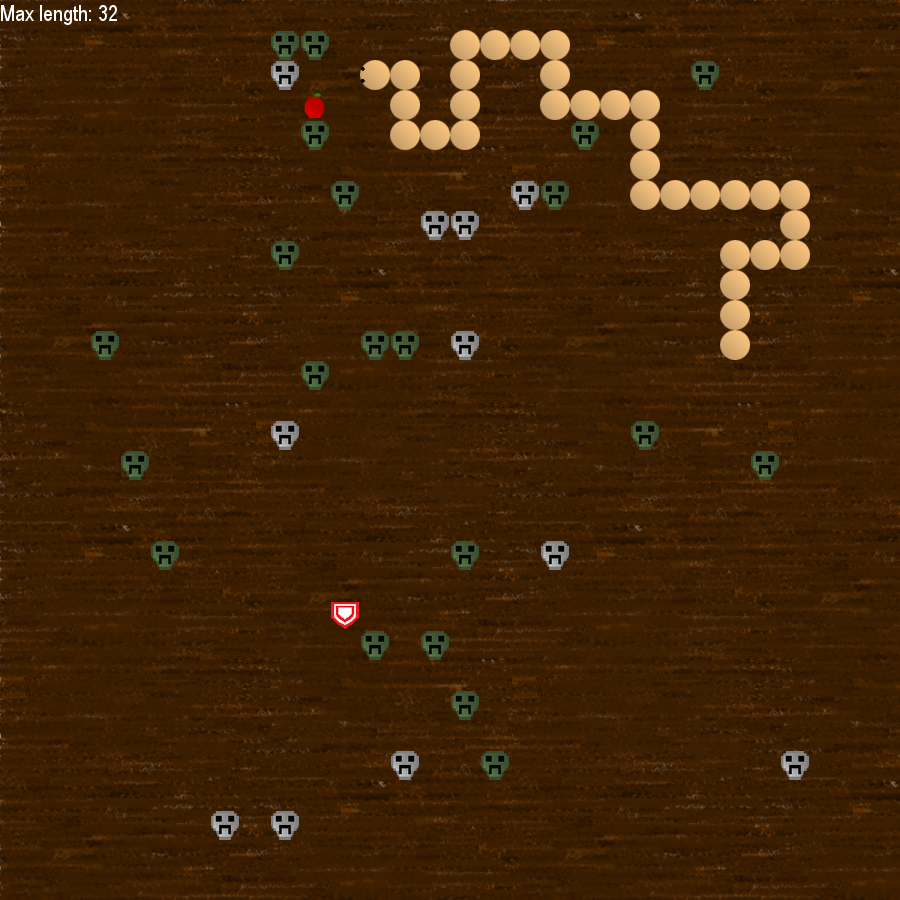

# PySnake

The classic arcade game Snake reimagined in Python using Pygame 🐍

## Requirements

- Python 3 with Pipenv

## Run

From the project directory:

```bash
pipenv sync
pipenv run python src/main.py
```

or:

```bash
bash run.sh
```

## Configuration

Look into `config.ini`

## Gameplay and Controls

Coming soon

### Screenshot

